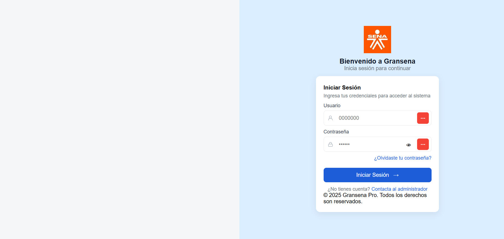
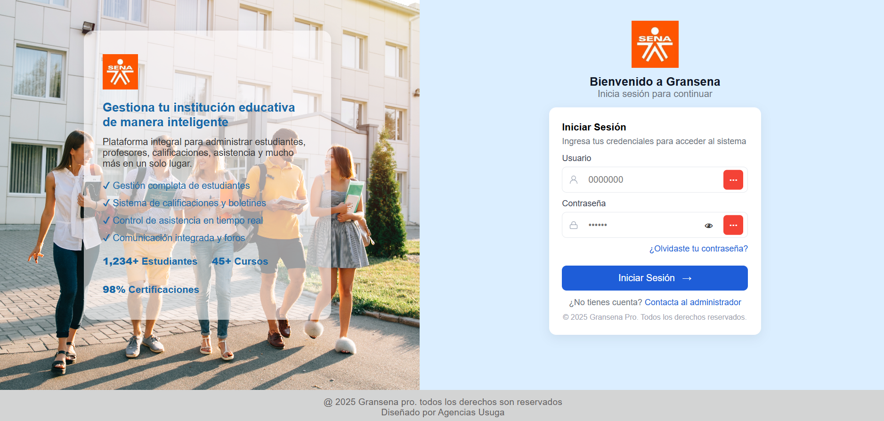

# Proyecto HU0002 – Formulario de Login (Base)

## 📌 Descripción
Este proyecto corresponde a la **HU0002 – Formulario de Login (Base)** del sistema **GranCole**, desarrollado como parte de una práctica para aplicar **GitFlow** y buenas prácticas de desarrollo.  
Incluye un formulario responsive de inicio de sesión con HTML, CSS y JavaScript, siguiendo el diseño proporcionado y reemplazando el escudo por el logo del SENA.

---

## 🎯 Requerimientos de la HU
- Dividir la pantalla en dos secciones:
  - **50% derecha:** formulario de login.
  - **50% izquierda:** espacio para integración de datos futuros.
- Reemplazar el escudo original por el **logo del SENA**.
- Desarrollar en **HTML, CSS y JS**.
- Diseño **responsive**.
- Seguir flujo de trabajo **GitFlow** en GitHub.

---

## Vista previa del Login

## Footer
El footer se muestra centrado, con color gris claro y fondo suave.
Los enlaces en el footer tienen color azul y subrayado.

## Accesibilidad y Usabilidad
Los campos de usuario y contraseña tienen iconos y placeholders.
El botón para mostrar/ocultar contraseña cambia el ícono según el estado.
El diseño es limpio, accesible y funcional en cualquier dispositivo.

## Vista previa del datos del sistema

## Resultado:
La página cumple con los requerimientos de mostrar información institucional y funcionalidades principales en el 50% izquierdo, y es completamente responsive para dispositivos móviles.